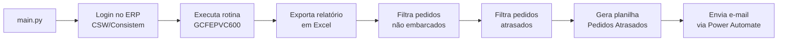

<div align="center">


# 🚚 Gerador de Relatório de Pedidos Atrasados

**Automação (RPA) que extrai os pedidos do ERP CSW/Consistem, identifica os pedidos não embarcados e atrasados e envia o relatório por e-mail — sem intervenção humana.**


</div>

---

## 📌 Descrição do Projeto

Acompanhar manualmente quais pedidos já passaram da data prevista de embarque é uma tarefa repetitiva: alguém precisa acessar o ERP, gerar o relatório de pedidos, exportar para Excel e cruzar cada linha para descobrir o que está atrasado.

Esta automação **elimina esse trabalho manual de ponta a ponta**. Utilizando **Playwright**, ela navega sozinha pelo ERP **CSW/Consistem**, executa a rotina de pedidos (**GCFEPVC600**), exporta o relatório em Excel e o processa com **pandas** para responder à pergunta central da operação:

> 🚨 **Quais pedidos ainda não foram embarcados e já estão atrasados?**

Ao final, o relatório consolidado de **Pedidos Atrasados** é gerado e **enviado automaticamente por e-mail** através de um fluxo do **Power Automate** — mantendo a equipe de logística sempre atualizada.

## ✨ Funcionalidades

- ✅ **Login automatizado no ERP** — acesso ao CSW/Consistem via Playwright, sem intervenção manual.
- ✅ **Extração automática de pedidos** — executa a rotina `GCFEPVC600` para o período dos últimos 30 dias até o dia seguinte.
- ✅ **Exportação em Excel** — o relatório do ERP é baixado e salvo automaticamente na pasta de destino.
- ✅ **Filtro de pedidos não embarcados** — isola os pedidos com situação de embarque `NÃO`.
- ✅ **Identificação de pedidos atrasados** — sinaliza os pedidos cuja previsão de embarque já passou da data atual.
- ✅ **Relatório consolidado** — gera a planilha `Consulta de Pedidos Atrasados` com a aba *Pedidos Atrasados*.
- ✅ **Envio automático por e-mail** — dispara o relatório em anexo via fluxo do Power Automate.
- ✅ **Execução headless e agendável** — roda em segundo plano e pode ser disparado por agendador de tarefas (`.bat`).
- ✅ **Registro completo de logs** — cada etapa é registrada em arquivo para auditoria e diagnóstico.

---

## 🛠️ Tecnologias Utilizadas

| Categoria | Tecnologia |
|-----------|------------|
| **Linguagem** | Python 3.14 |
| **Automação de navegador (RPA)** | Playwright |
| **Processamento de dados** | pandas · numpy |
| **Leitura de Excel** | openpyxl |
| **Geração de Excel** | XlsxWriter |
| **Requisições HTTP / integração** | requests |
| **Variáveis de ambiente** | python-dotenv |
| **Envio de e-mail** | Power Automate (fluxo externo) |

---

## 📋 Pré-requisitos

Para executar a aplicação são necessários os seguintes requisitos:

- 🐍 **Python 3.14** (ou superior) instalado — [python.org/downloads](https://www.python.org/downloads/)
- 📦 **pip** disponível no `PATH` (já incluso no instalador oficial do Python)
- 🪟 **Windows** — a automação e o agendamento são pensados para o ambiente Windows
- 🌐 **Navegadores do Playwright** instalados (`playwright install`)
- 🔐 **Acesso ao ERP CSW/Consistem** — URL, usuário e senha válidos
- 🔗 **Fluxo do Power Automate** configurado para o envio do e-mail (URL do webhook)

---

## ⚙️ Configuração (variáveis de ambiente)

As credenciais e endpoints sensíveis **não ficam no código** — são lidos de um arquivo `.env` na raiz do projeto. Crie o arquivo com o seguinte conteúdo:

```env
CSW_URL=http://SEU_ERP/
CSW_USER=seu_usuario
CSW_PASS=sua_senha
URL_FLOW=https://sua-url-do-power-automate
```

| Variável | Descrição |
|----------|-----------|
| `CSW_URL` | Endereço do ERP CSW/Consistem |
| `CSW_USER` | Usuário de acesso ao ERP |
| `CSW_PASS` | Senha de acesso ao ERP |
| `URL_FLOW` | URL do fluxo do Power Automate que envia o e-mail |

> ⚠️ **Nunca versione o arquivo `.env`** — adicione-o ao `.gitignore` para proteger as credenciais.

---

## 🚀 Como Executar o Projeto

### 1️⃣ Clonar o repositório

```bash
git clone https://github.com/grupoflexivel/gerador-relatorio-pedidos.git
cd gerador-relatorio-pedidos
```

### 2️⃣ Criar e ativar um ambiente virtual

```bash
# Criação
python -m venv venv

# Ativação (Windows PowerShell)
.\venv\Scripts\Activate.ps1

# Ativação (Windows CMD)
venv\Scripts\activate.bat
```

### 3️⃣ Instalar as dependências

```bash
pip install -r requirements.txt
```

Em seguida, instale os navegadores utilizados pelo Playwright:

```bash
playwright install
```

### 4️⃣ Configurar as variáveis de ambiente

Crie o arquivo `.env` conforme a seção [⚙️ Configuração](#️-configuração-variáveis-de-ambiente).

### 5️⃣ Executar a aplicação

```bash
python main.py
```

Ao rodar, a automação executa todo o fluxo de forma autônoma:

1. **Realiza o login** no ERP CSW/Consistem.
2. **Executa a rotina** `GCFEPVC600` e **exporta** o relatório de pedidos em Excel.
3. **Filtra** os pedidos não embarcados e atrasados.
4. **Gera** a planilha `Consulta de Pedidos Atrasados DDMMYYYY.xlsx`.
5. **Envia** o relatório por e-mail via Power Automate.

---

### 🕒 (Opcional) Execução agendada

Para rodar a automação de forma recorrente, utilize o script [`relatorio_pedidos.bat`](relatorio_pedidos.bat) junto ao **Agendador de Tarefas do Windows**:

```bat
@echo off
set PYTHON="C:\Program Files\Python314\python.exe"
set SCRIPT_PATH=C:\Automacoes\Gerador_Relatorio_Pedidos\main.py
%PYTHON% %SCRIPT_PATH%
```

Basta cadastrar esse `.bat` como ação de uma tarefa agendada com a periodicidade desejada.

---

## 📂 Estrutura de Pastas

```
.
├── main.py                  # Ponto de entrada: orquestra login, análise e envio
├── gerador_relatorio.py     # Automação Playwright: login e extração do relatório no ERP
├── analisa_relatorio.py     # Análise com pandas: filtra pedidos não embarcados e atrasados
├── notificador.py           # Envio do relatório por e-mail via Power Automate
├── relatorio_pedidos.bat    # Script de execução para agendamento (Windows)
├── requirements.txt         # Dependências do projeto
├── reports/                 # Relatórios exportados do ERP
├── logs/                    # Registros de execução (rpa_pedidos.log)
├── logo.png                 # Identidade visual
└── README.md
```

---

## 📄 Fluxo de Execução



---

## 👥 Autores / Contribuidores

| Autor | Contato |
|-------|---------|
| **Equipe de TI — Grupo Flexível** | 📧 [sistemas@grupoflexivel.com.br](mailto:sistemas@grupoflexivel.com.br) |

---

## 📄 Licença

Projeto **proprietário** — desenvolvido para uso interno do **Grupo Flexível**. Todos os direitos reservados.

<div align="center">

Feito com 🐍 e ☕ pelo time de **TI do Grupo Flexível**

</div>
